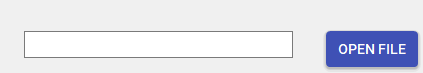

# Steganography
 Steganography project with Diffie-Hellman
Steganography with Diffie-Hellman Key Exchange

  
Contents

  <ol>
    <li><a href="#Diffie-Hellman and HMAC creation and verification">Diffie-Hellman and HMAC creation and verification</a></li>
    <li><a href="#Stegranography">Stegranography</a></li>
    <li><a href="#Decoding">Decoding</a></li>
    <li><a href="#Sources">Sources and References</a></li>

  </ol>

### Diffie-Hellman and HMAC creation and verification
“Diffie–Hellman (DH) key exchange is a mathematical method of securely generating a symmetric cryptographic key over a public channel and was one of the first public-key protocols as conceived by Ralph Merkle and named after Whitfield Diffie and Martin Hellman.” -Wikipedia

Users will enter the numbers in the numericUpdowns, then press the exchange keys. 

By doing this, “Alice” and  “Bob” exchange numbers: a and b.The generator (g) and prime number(p) is currently preset, but for later modifications, those can be added in the UI too. 

By pressing the “Exchange keys” button it is calculated for Alice: B^a mod p, and for Bob: A^b mod p. This will be the shared secret. It is verified that both of them have the same value of A and B.

The shared key is converted into a byte array and shown in a MessageBox. The conversion means that the LSB is stored first.

For integrity purposes and to eliminate the possbility of a man-in-the middle attack, the shared secret is encoded with HMAC using SHA-256 and it is verified that the HMAC’s match.

After verification, the “Open File” button is enabled, so that the user can select a file for the steganography process. For learning purpose, the results of calculations and shared key, are shown in labels.

### Steganography - Selecting an image and encoding

“ Steganography is the practice of representing information within another message or physical object, in such a manner that the presence of the concealed information would not be evident to an unsuspecting person's examination. In computing/electronic contexts, a computer file, message, image, or video is concealed within another file, message, image, or video.”  -Wikipedia

Only jpg and png formats can be selected.

After selecting an image, the “Send” buttom becomes enabled. The user has to enter the message to encrypt inside the textbox, and the press send. The textbox under ecrypted will contain the message that was sent to be encrypted. The File Explorer will open to save the  file with the new image, with a png extension.

The length of the image is stored in the last pixel (in the Green and Blue colors). The encryption is done with XOR using the shared key, and the encrypted data si spread across the image in the blue pixels. The first blue pixel will hold the first value of the encrypted data, and it will continue to encrypt until there is no more value from the encrypted code left. In case the key is longer that the message, the key is written more times.

### Decoding

After encoding, the name of the saved file is shown in the textbox, near the “Open file” button. At decoding, the last pixel is checked for steganography message length. The green and the blue pixels will contain the MSB and LSB of that value. After checkign the value, all of the blue pixels will be checked for the encrypted message, until the length of the message is reached.Here XOR is used for decryption, since we used XOR for encryption too. After we got the message from the encrypted file, the decrypted message is written in the textbox under the “Decrypt” label.

Image-  original and encrypted

While in the image from above the pixels seem the same, if we try hiding the same message in a black or a white image, then it is clearly visible that the last pixel holds the message length and where the pixels that hold the message are.

 ### Sources and references:

[1] Whats the standard code to generate HMAC SHA256 with key using C# ( https://www.youtube.com/watch?v=TdWXN-_Ti2Q ) 

[2] How to do Image Steganography using C#  (https://www.youtube.com/watch?v=97Vz6wyHeeM&list=PL1bWnw04XAnbt56GjNHk4NLlHNQ8Nhtd7&index=1,
https://www.youtube.com/watch?v=DfFo59C9yK4&list=PL1bWnw04XAnbt56GjNHk4NLlHNQ8Nhtd7&index=2,
https://www.youtube.com/watch?v=g_42a6E4aEw&list=PL1bWnw04XAnbt56GjNHk4NLlHNQ8Nhtd7&index=3,
https://www.youtube.com/watch?v=e59JvHHWwhk&list=PL1bWnw04XAnbt56GjNHk4NLlHNQ8Nhtd7&index=4 )

[3] C# 6.0 Tutorial - Advanced - 60. ECDiffieHellmanCng Cryptography, Encrypt and Decrypt ( https://www.youtube.com/watch?v=xpO-ckTESJU) 

[4] Diffie–Hellman key exchange ( https://en.wikipedia.org/wiki/Diffie%E2%80%93Hellman_key_exchange ) 

[5] Steganography ( https://en.wikipedia.org/wiki/Steganography ) 

 
